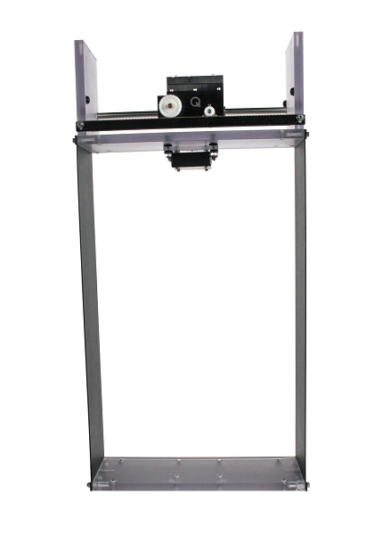

# QuanserActiveMassDamper
This repo contains files related to Quanser's active mass damper (AMD).
The AMD system has a platform held aloft by two upright flexible plates.
Disturbances at the base cause the platform to vibrate.
Controlling the movement of a cart on top of the platform can damp the vibrations.
This is the basic principle for some earthquake protection devices in skyscrapers.

The official product page is:
https://www.quanser.com/products/active-mass-damper/
